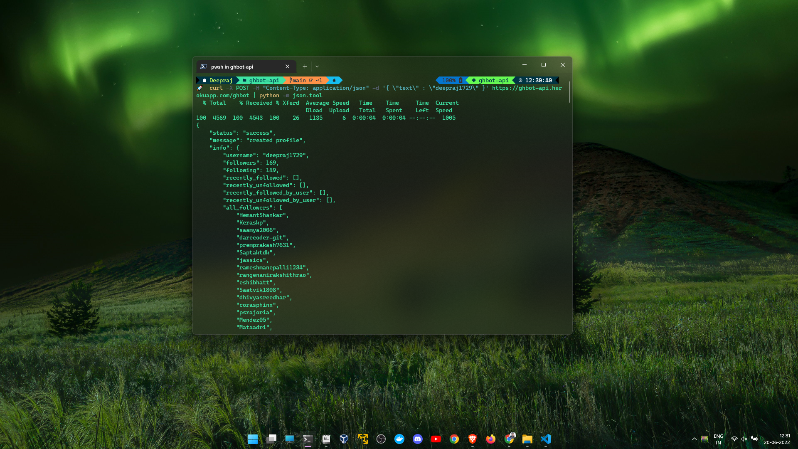

# GhBot

A simple github bot to retrieve data from github and track user activity

## Usage:
For `Windows` users:

        curl -X POST -H "Content-Type: application/json" -d '{ \"text\" : \"enter_github_username\" }' https://ghbot-api.herokuapp.com/ghbot | python -m json.tool

For `Linux` and `Mac` users:

        curl -X POST -H "Content-Type: application/json" -d '{ "text" : "enter_github_username" }' https://ghbot-api.herokuapp.com/ghbot | python -m json.tool

## Tools Used:
- BeautifulSoup
- Requests
- FastAPI

## Endpoints:
    /ghbot

## Installation
Install using conda:

    conda create -n ghbot python=3.9

    conda activate ghbot

    pip install -r requirements.txt

## Run the application:
Run the API:

    uvicorn api:app --reload

## API Testing:
- Test the local api created with `fastapi` using python:
    
        python post.py -u "enter_github_username"

- Test the local api with `CURL`:

    For `Windows` users:

        curl -X POST -H "Content-Type: application/json" -d '{ \"text\" : \"enter_github_username\" }' http://127.0.0.1:8000/ghbot | python -m json.tool

    For `Linux` and `Mac` users:

        curl -X POST -H "Content-Type: application/json" -d '{ "text" : "enter_github_username" }' http://127.0.0.1:8000/ghbot | python -m json.tool

- Test the production api with `CURL`:

    For `Windows` users:

        curl -X POST -H "Content-Type: application/json" -d '{ \"text\" : \"enter_github_username\" }' https://ghbot-api.herokuapp.com/ghbot | python -m json.tool

    For `Linux` and `Mac` users:

        curl -X POST -H "Content-Type: application/json" -d '{ "text" : "enter_github_username" }' https://ghbot-api.herokuapp.com/ghbot | python -m json.tool

## Deployment:
I used heroku for deployment. The steps are given below:

- Login/sign up to [heroku](https://www.heroku.com/)
- Download [heroku-cli](https://devcenter.heroku.com/articles/heroku-cli) if not installed
- Login with heroku-cli:
        
        heroku login
- Create an app on heroku:
        
        heroku create -a "your-app-name"
- Check your project's remote origins:

        git remote -v
- Now add the remote origin of heroku app with your local repo:
        
        heroku git:remote -a "your-app-name"
- Deploy or push local code to remote origin of heroku app:
        
        git push heroku main
- Tada the API is live on [https://`your-app-name`.herokuapp.com]()
